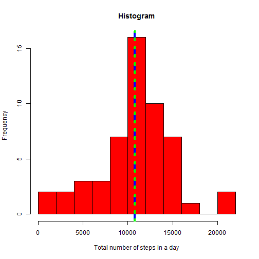
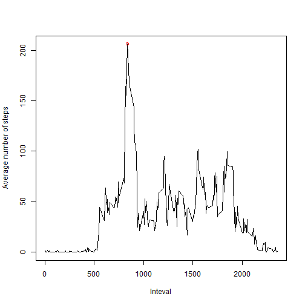
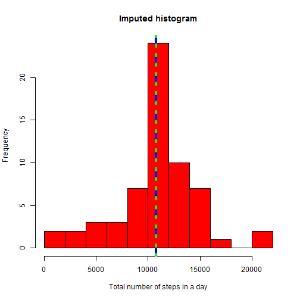
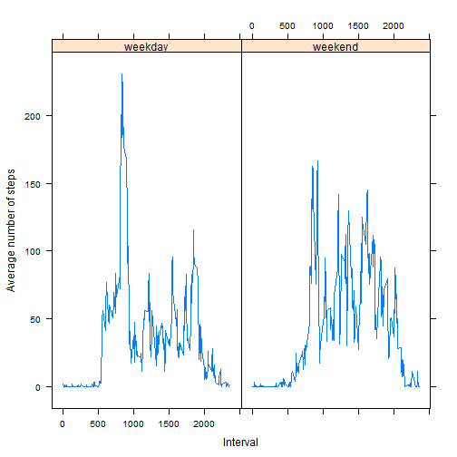

## Loading and preprocessing the data

```r
setwd("C:/Users/João/Documents/Coursera/5.repdata/RepData_PeerAssessment1/")
data <- read.csv("activity.csv")
data$date <- as.Date(data$date,format = "%Y-%m-%d")
```


## What is mean total number of steps taken per day?

```r
totalnumberofsteps <- tapply(data$steps,data$date,sum)
mean_steps <- round(mean(totalnumberofsteps,na.rm=T),1)
median_steps <- median(totalnumberofsteps,na.rm=T)
hist(totalnumberofsteps, breaks = 10, col="red",  main = "Histogram", xlab = "Total number of steps in a day")
abline(v = mean_steps, col = "blue",lwd = 4, lty = "dashed")
abline(v = median_steps, col = "green", lwd = 4, lty = "dotted")
```

 

The figure above shows the histogram of the total number of steps taken per day. The mean (1.07662 &times; 10<sup>4</sup>, blue dashed line) and median (10765, green dotted line) of the number steps are represented in the figure by vertical lines.

## What is the average daily activity pattern?

```r
averagedailyactivity <- with(data,tapply(steps,interval,mean, na.rm=T))
day5mininterval <- as.numeric(names(averagedailyactivity))
plot(day5mininterval, averagedailyactivity,type = "l", xlab = "Inteval", ylab = "Average number of steps")
points(day5mininterval[which.max(averagedailyactivity)],max(averagedailyactivity),col="red")
```

 

```r
maxnumberstepsinterval <- day5mininterval[which.max(averagedailyactivity)]
```

The maximum number of steps occurred for the 5-minutes interval 835. So, at 8:35 am.

## Imputing missing values

There are 2304 rows with missing values. The missing values were imputed using the mean number of steps for eacht 5-minute interval.


```r
newdata <- data
for(i in day5mininterval){
      newdata$steps <- replace(newdata$steps,
                            is.na(newdata$steps) & newdata$interval == i,
                            averagedailyactivity[day5mininterval == i])
}

totalnumberofsteps <- tapply(newdata$steps,newdata$date,sum)
mean_steps <- round(mean(totalnumberofsteps,na.rm=T),1)
median_steps <- round(median(totalnumberofsteps,na.rm=T),1)
hist(totalnumberofsteps, breaks = 10, col="red", main = "Imputed data histogram", xlab = "Total number of steps in a day")
abline(v = mean_steps, col = "blue",lwd = 4, lty = "dashed")
abline(v = median_steps, col = "green", lwd = 4, lty = "dotted")
```

 

The figure above shows the histogram of the total number of steps each day after imputing  missing values. The mean (1.07662 &times; 10<sup>4</sup>, blue dashed line) and median (1.07662 &times; 10<sup>4</sup>, green dotted line) of the number steps are represented in the figure by vertical lines.


## Are there differences in activity patterns between weekdays and weekends?


```r
Sys.setlocale("LC_TIME", "English")
```

```
## [1] "English_United States.1252"
```

```r
newdata$isweekday <- as.factor(weekdays(newdata$date))
levels(newdata$isweekday) <- c("weekday", "weekday", "weekend", "weekend", "weekday","weekday","weekday")

library(dplyr)
newdata1 <- newdata %>% group_by(interval,isweekday) %>%
      summarise(averagenumberofsteps = mean(steps))

library(lattice)
with(newdata1,xyplot(averagenumberofsteps ~ interval | isweekday,
                     type="l", ylab = "Average number of steps", xlab = "Interval"))
```

 


